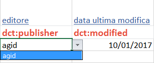
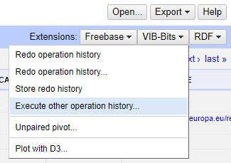
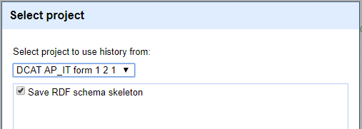
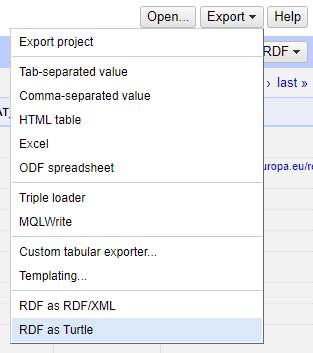

semantic_spreadsheet
====================

Il foglio di calcolo, da usare in abbinamento al corrispondente progetto per Google Refine, semplifica la creazione di un dataset di metadati conforme alle specifiche DCAT-AP_IT, in questo modo è possibile produrre semplici file RDF di metadati e prendere confidenza con le specifiche stesse.

**Prerequisiti**

Il progetto necessita dell'installazione di Google Refine preferibilmente la versione 2.5 [pagina download](http://openrefine.org/download.html).

Devono poi essere installati le seguenti estensioni:

- [rdf-extension](https://github.com/fadmaa/grefine-rdf-extension/downloads) (versione 0.8)
- [vib-bits](https://www.bits.vib.be/software-overview/openrefine) (versione 1.835)

l'installazione consiste nello scompattare i file zippati delle estensioni nella directory workspace di Open Refine che di norma su windows è : *C:\Users\nomeutente\AppData\Roaming\Google\Refine\extensions* (crearla se non esiste).

*NOTA: in basso nella pagina [home](http://127.0.0.1:3333/) dei progetti di Refine c'è il link alla directory di workspace.*

Al termine dell'installazione verificare la presenza in alto a destra delle voci di munù relative alle due estensioni come in figura

## Compilare lo spreadsheet
La struttura del file *DCAT-AP_IT-form-1.2.xlsx* è la seguente, i primi cinque fogli rappresentano le classi principali utilizzate all'interno del modello dei metadati:

- Soggetto 
- Catalogo
- Dataset
- Distribution
- Contatto

i secondi cinque fogli rappresentano dei vocabolari controllati di termini da utilizzare nei primi cinque per compilare i metadati in corrispondenza di specifiche proprietà:

- Temi  
- Lingue
- Frequenza
- Tipofile
- Licenze

se il contenuto di una colonna è regolato da un vocabolario controllato, quella colonna ha un vincolo sul contenuto impostato con una lista di termini ammissibili da scegliere durante la compilazione.

*NOTA:il controllo è impostato sulle celle fino alla riga 20, in caso di necessità può essere esteso con la funzionalità di copia, nelle celle sottostanti, delle celle già vincolate.*

Qui vediamo l'elenco dei Soggetti (uno solo: Agid) e la corrispondente cella vincolata nel metadato dell'editore di un catalogo

La colonna #ID in ognuno dei primi 5 fogli rappresenta l'identificativo univoco che contribuisce alla creazione delle URI generate da Refine, ad esempio inserire "Agid" nella colonna #ID del foglio Soggetto porta alla creazione della URI 
> <http://sample.org/meta/agent/agid>

per l'istanza di dcatapit:Agent dell'amministrazione che pubblica il catalogo. 

*NOTA:utilizzando l'estensione RDF di Refine è comunque possibile modificare la URI base "http://sample.org/meta"*

Refine lavora per righe quindi in tutti i casi in cui per una proprietà del profilo sia necessario collegare più di un valore occorre replicare la riga, con il suo #ID eggiungendo il valore nella colonna desiderata. Nell'esempio seguente il catalogo "cat1" ha associati 4 dataset.

## Importare il progetto originale in Refine

Il file di progetto originale *DCAT-AP_IT-form-1-2-1.google-refine.tar.gz* va importato in Open Refine, in questo modo si inserisce nel workspace il progetto con tutte le regole di mapping (RDF template) e i dati di esempio.

## Aggiornare i dati del progetto

Una volta modificato il file XLSX inserendo i propri metadati, questo va "caricato" in Open Refine eseguendo su questi dati il processo di triplificazione descritto dal template RDF. Questa operazione va fatta nel modo seguente:

- creare un **nuovo progetto** partendo dal file XLSX modificato contenente i metadati da triplificare.

> dalla home di Refine [Create project] ==> [Scegli file] ==> [Next] e quindi creare il progetto con le impostazioni in figura

- **copiare le regole** di triplificazione copiando l'history dal progetto originale

> Aprire il menù dall'estensione VIB-Bits e scegliere l'esecuzione delle operazione dallo storico di un altro progetto come in figura

> Selezionare il progetto originale e procedere

- eseguire l'**export** RDF per la triplificazione  

> Aprire il menù di export e scegliere una delle due opzioni RDF come in figura (Turtle)

* * *

SEE: [teamdigitale/daf](https://github.com/teamdigitale/daf) 
